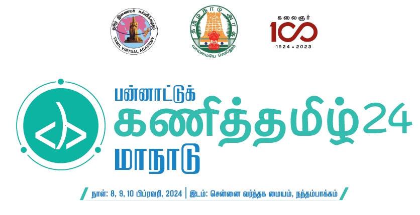

<div align="center">
  <h1>📚 Karka Kasadara</h1>
  <p><em>Empowering Tamil Literature Enthusiasts through Community, Resources, and Collaboration</em></p>
</div>

<p align="center">
  
</p>

<div align="center">

  
  
  
  
  

</div>

## 🌟 Features

- **💬 Chat Website:** Real-time conversation for idea exchange within the Tamil Literature community.
- **🎥 Meet Website:** Organize virtual and in-person networking events, seminars, and collaborative sessions.
- **🔐 Login/SignUp Page:** Secure access to a range of resources and community features.
- **📂 Job Portal:** A platform to discover and apply for relevant job opportunities.
- **📚 Resources Website:** Repository for articles, guides, tools, and materials dedicated to Tamil literature.

## 🛠️ Tech Stack

- **Frontend:** HTML, CSS, JavaScript
- **Backend:** Firebase for database management and storage
- **Voice and Video SDK:** Agora for seamless communication
- **Version Control:** GitHub for collaboration and code management

## 🚀 Quick Start

1. **Clone the repository**
   ```bash
   git clone https://github.com/pranavsuriya-sr/karkaKasadara.git
   cd karkaKasadara
   ```

2. **Set up Firebase**
   - Create a Firebase project on [Firebase Console](https://console.firebase.google.com/)
   - Replace Firebase configuration in the `index.js` file with your project credentials

3. **Launch the Application**
   - Open `index.html` in your browser.
   - For an enhanced development experience, use a local server like [Live Server](https://marketplace.visualstudio.com/items?itemName=ritwickdey.LiveServer)

## 🎨 Prototype

Explore the live prototype of the website here: [Karka Kasadara](https://pranavsuriya-sr.github.io/karkaKasadara/)

## 🏆 Scalability and Adaptability

The Karka Kasadara platform is highly adaptable and encourages contributions from open-source enthusiasts. Its beginner-friendly tech stack (HTML, CSS, JavaScript) ensures ease of access for new developers, while Firebase enables scalability, ensuring smooth performance with increasing user traffic and data.

## 🤝 Contributing

We welcome contributions! Please follow these steps:

1. Fork the repository.
2. Create your feature branch (`git checkout -b feature/FeatureAddition`).
3. Commit your changes (`git commit -m 'Add some Amazing Feature'`).
4. Push to the branch (`git push origin feature/FeatureAddition`).
5. Open a Pull Request.

## 📜 License

This project is licensed under the MIT License - see the [LICENSE](LICENSE) file for details.

## 📞 Contact

For questions or feedback, feel free to reach out to [Pranav Suriya](https://github.com/pranavsuriya-sr) on GitHub.

---

<div align="center">
  Made with ❤️ by <a href="https://github.com/pranavsuriya-sr">Pranav Suriya</a>
</div>
